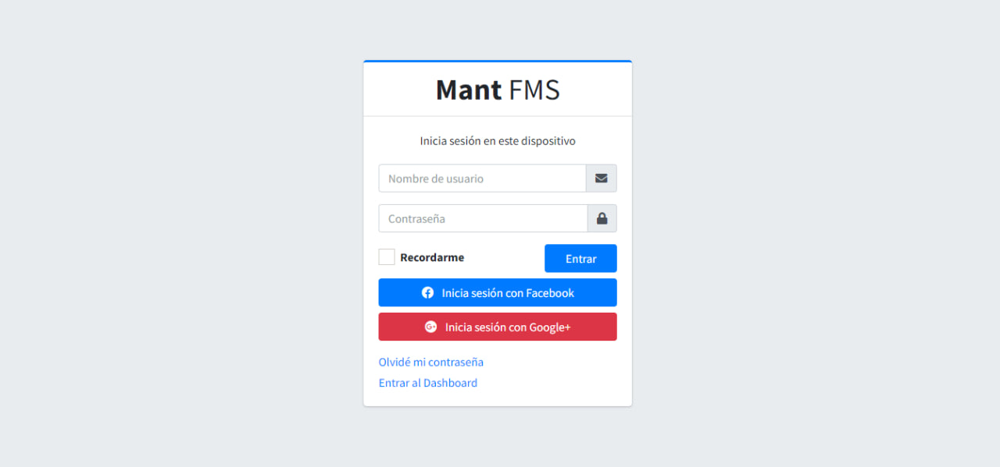
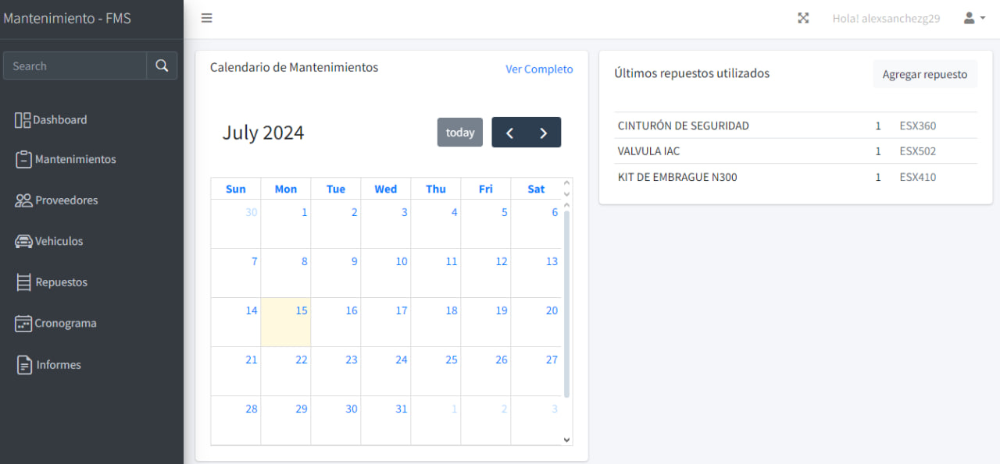
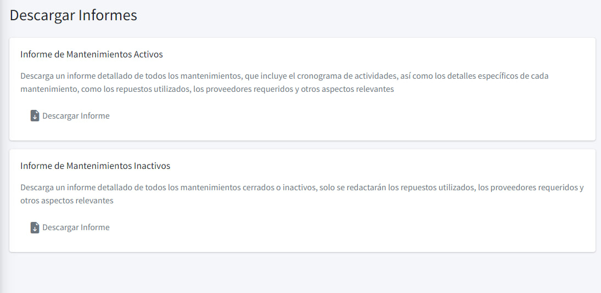
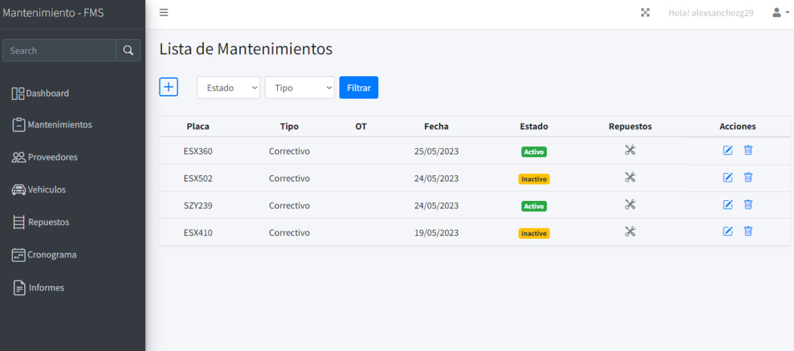
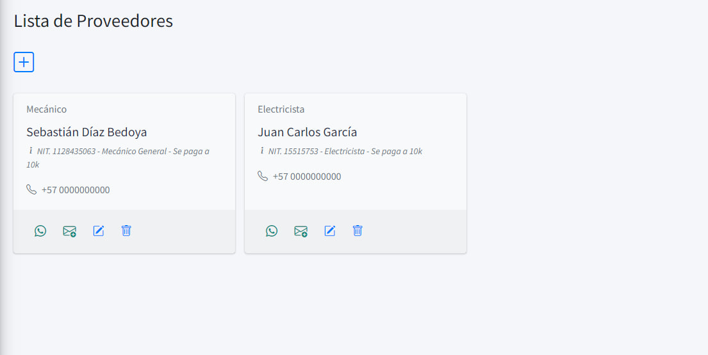
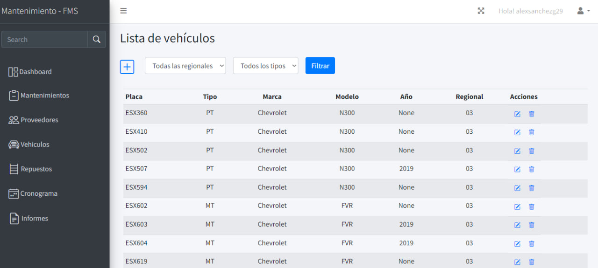

## NOTA - POR SEGURIDAD SOLO SE PUEDE INGRESAR AL DASHBOARD DE LA APLICACION!

# 🚛 FMS - Sistema de Gestión de Flotas 🚛

Bienvenido al sistema de gestión de flotas (FMS) para el área de mantenimiento de una empresa de transporte. Esta aplicación web está diseñada para organizar y gestionar de manera eficiente el mantenimiento de los vehículos, la gestión de repuestos, proveedores, informes y más.

## 🚀 Funcionalidades Principales

- **Cronograma** 📅: Organización y planificación de mantenimientos.
- **Cuenta** 🔑: Gestión de usuarios (acceso seguro sin registro).
- **Dashboard** 📊: Resumen general de las actividades y estado de los vehículos.
- **Informes** 📝: Generación de informes en PDF de los mantenimientos realizados.
- **Mantenimiento** 🛠️: Visualización y gestión de todos los mantenimientos de los vehículos.
- **Proveedores** 📞: Contactos de todos los proveedores.
- **Repuestos** 🧩: Gestión de todos los repuestos disponibles.
- **Vehículos** 🚗: Visualización y gestión de todos los vehículos de la flota.

## 📂 Estructura del Proyecto

El proyecto está compuesto por las siguientes aplicaciones:

### Cronograma 📅

Organización y planificación de todos los mantenimientos. Aquí puedes ver y programar los mantenimientos futuros.

### Cuenta 🔑

Gestión de usuarios. Solo permite el acceso de usuarios previamente registrados por seguridad.

### Dashboard 📊

Un panel de control que muestra un resumen general de las actividades y el estado actual de los vehículos.

### Informes 📝

Generación de informes detallados en formato PDF sobre los mantenimientos realizados.

### Mantenimiento 🛠️

Visualización y gestión de todos los mantenimientos de los vehículos. Permite registrar y consultar los mantenimientos realizados.

### Proveedores 📞

Gestión de los contactos de todos los proveedores. Permite agregar, editar y eliminar contactos de proveedores.

### Repuestos 🧩

Gestión de todos los repuestos disponibles. Permite agregar, visualizar y gestionar los repuestos necesarios para los mantenimientos.

### Vehículos 🚗

Visualización y gestión de todos los vehículos de la flota. Permite agregar nuevos vehículos y gestionar la información de los existentes.

